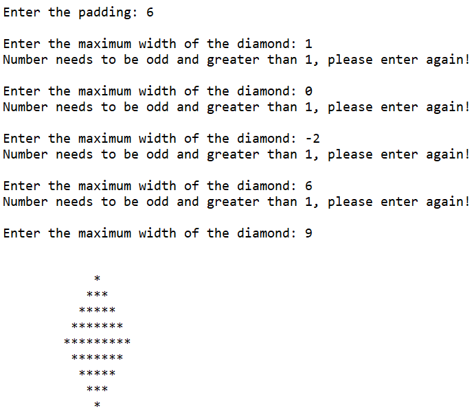
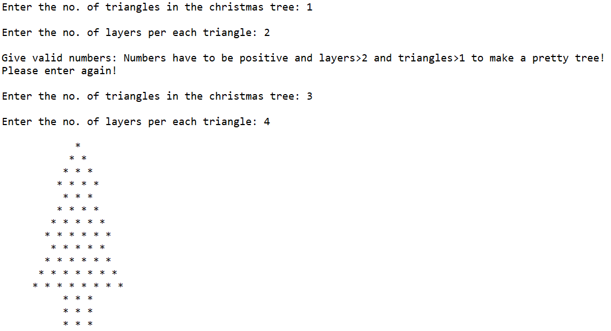

# Python-Patterns
This is a project written in python code to print different types of weird patterns.

## 1. Diamond
The diamond pattern is printed based on the Max_width and padding. 
Padding is just for decoration purposes to make it print wherever we want. 
Max_width is used to get the number of maximum * to be printed.
This code uses only **one nested loop**.

The output is shown below:

## 2. Christmas Tree
The christmas tree pattern is printed based on two inputs- triangles and layers.
Triangles will show the no. of triangles printed in the tree.
Layers will show the no. of rows printed per each triangle.
This code uses only **one nested loop**.

The output is shown below:

